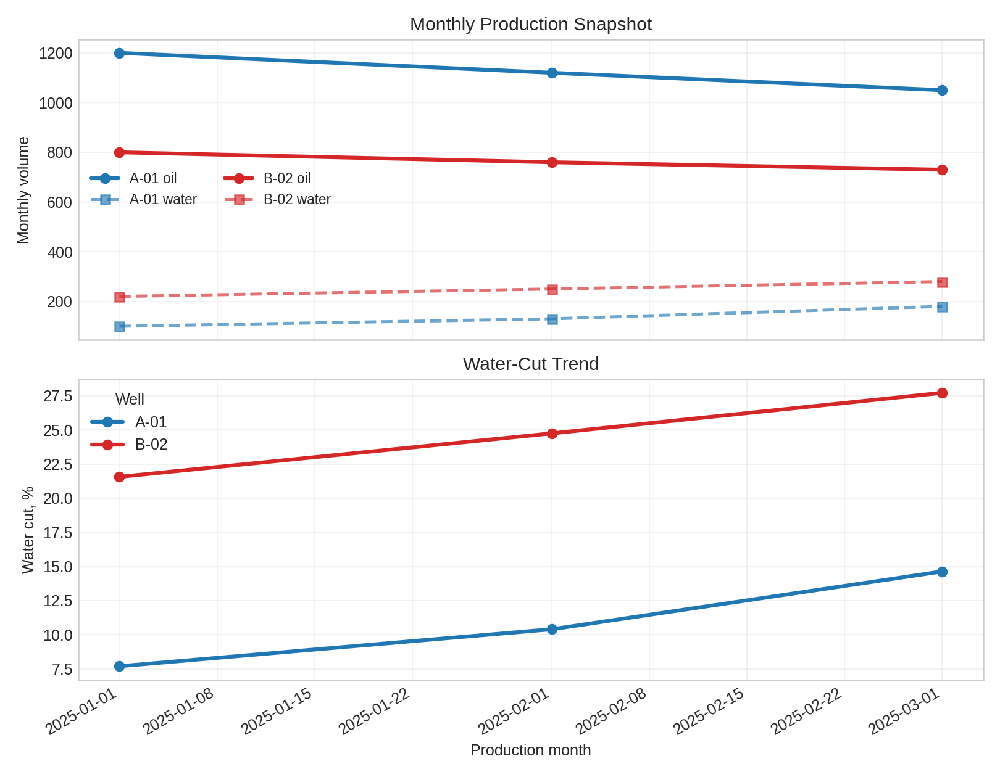

# Exercise 7: CLI Workflow

**Best practice:** let Hermes combine shell tools and Python checks for repeatable data QA.

## Scenario

You receive monthly production CSVs. Before DCA or material balance, ask Hermes to inspect schema, missing values, duplicate dates, and monotonic cumulative production.

## Engineering Context

CSV QA is not clerical work. Bad dates, duplicate well-month rows, negative volumes, or swapped oil/water columns can make a decline curve look technically impressive while being built on corrupted data.

For the sample file, a useful CLI workflow should answer:

- Are all required columns present?
- Do dates parse as dates?
- Are oil, water, and gas volumes nonnegative?
- Is there exactly one row per `well` and `date`?
- Do the plotted trends match the tabulated summary?

The generated production plot is the visual companion to those checks.



## Prompt

```text
Use shell commands to inspect 01_explore_plan_code/sample_production.csv.
Then write a short Python QA script that checks required columns, nonnegative rates, and duplicate well/date rows.
Run it and summarize the result.
```

## Extension

Use this same pattern on real exports before fitting decline curves or running material balance.

## Better Output Standard

Ask Hermes to return:

```text
Schema check: pass/fail with column list
Row count: total rows and date range
Data quality: missing values, negative values, duplicate well/date rows
Engineering checks: water-cut range, GOR range, and any suspicious jumps
Artifacts: generated CSV/plot paths if created
```

This turns terminal work into an auditable pre-analysis note rather than a stream of commands.
