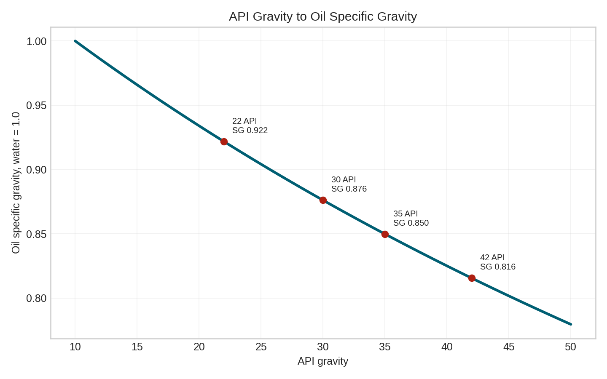
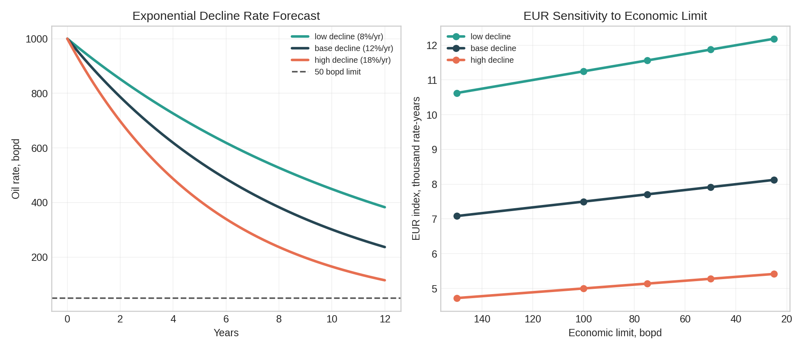
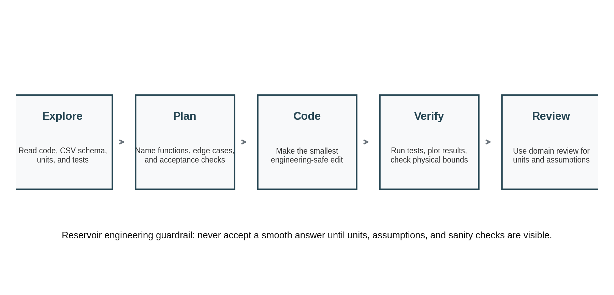

# Hermes for Reservoir Engineering

Ported from [Claude-for-reservoir-engineering](https://github.com/gabrielserrao/Claude-for-reservoir-engineering) for Nous Research Hermes Agent.

## Quick Start

1. Install Hermes Agent: https://hermes-agent.nousresearch.com/docs/
2. Open terminal in this folder.
3. Run: `hermes`
4. Load skills with `/skill reservoir-engineering`
5. Ask: `Read 01_explore_plan_code/ and add water cut trend analysis.`

## Project Layout

| Path | What |
|------|------|
| `01_explore_plan_code/` | Read code/data first, then edit |
| `02_specific_context/` | Give exact file, test, formula |
| `03_verify_your_work/` | Use pytest + sanity checks |
| `04_init_project_memory/` | Initialize `CLAUDE.md` / `AGENTS.md` |
| `05_skills/` | Reusable domain skills |
| `06_subagent_review/` | Delegate review to subagent |
| `07_cli_workflow/` | Combine shell + Python QA |
| `08_mcp_pyrestoolbox/` | MCP for live PVT calculations |
| `09_parallel_fanout/` | Split scenarios with `delegate_task` |
| `.hermes/skills/` | Hermes-style skill files |
| `AGENTS.md` | Reviewer subagent prompt |
| `CLAUDE.md` | Project rules loaded by `/init` |

## Sample Graphs

Run `python scripts/generate_course_figures.py` to regenerate.

| Graph | File | Description |
|-------|------|-------------|
| Monthly Production & Water-Cut |  | Oil/water volumes and water-cut % trend by well |
| PVT API-to-Specific-Gravity |  | API gravity vs oil-specific gravity curve with sample points |
| DCA Decline & EUR Sensitivity |  | Exponential decline curves and EUR sensitivity to economic limit |
| Engineering Workflow Map |  | 5-step guardrail workflow (explore-plan-code-verify-review) |

## Loaded Context

`CLAUDE.md` and `AGENTS.md` sit at repo root. Hermes reads `CLAUDE.md` when you run `hermes --worktree` or explicitly `/init`.

## Key Hermes Commands

```text
hermes                              # start session in this repo
hermes -w                           # isolated worktree (git-safe parallel agents)
hermes -s reservoir-engineering     # preload skill
/skill reservoir-engineering        # load within session
/skill run-tests                    # load test skill
/init                               # reload CLAUDE.md project rules
/delegate_task                      # spawn subagent for review or parallel work
/cron                               # schedule recurring analysis
/agents                             # list active subagents
```

## Security Note

For destructive commands, use `hermes config set approvals.mode manual` (default) or `--yolo` for CI/batch. Hermes runs shell through `terminal()` tool — the reservoir exercises intentionally allow `python`, `python3`, `pytest`, and `uv run`.
